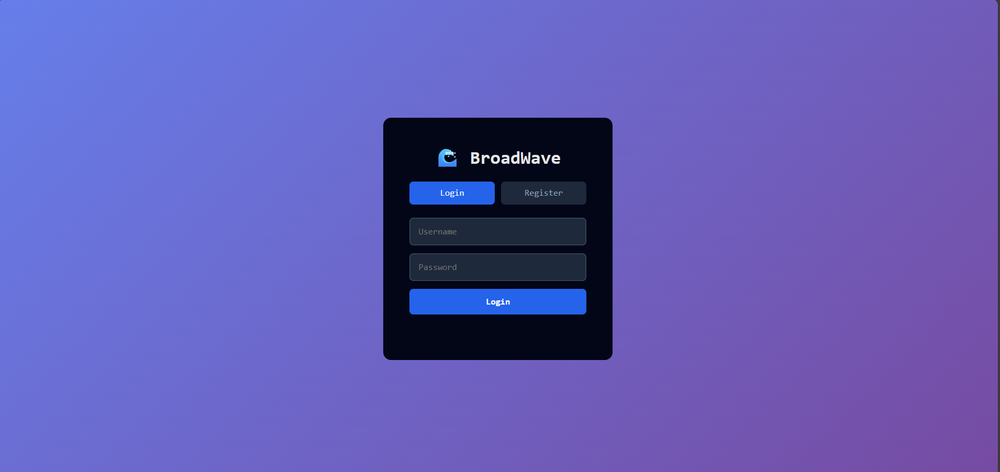
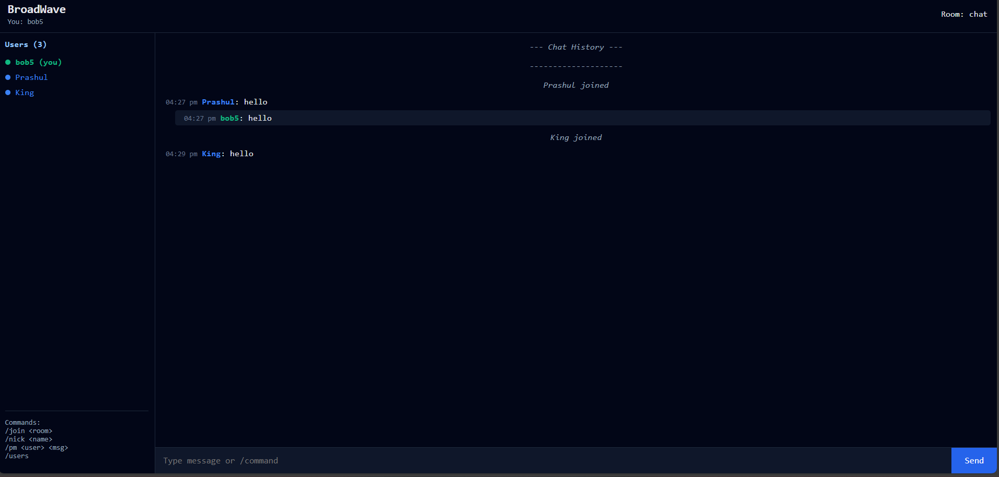
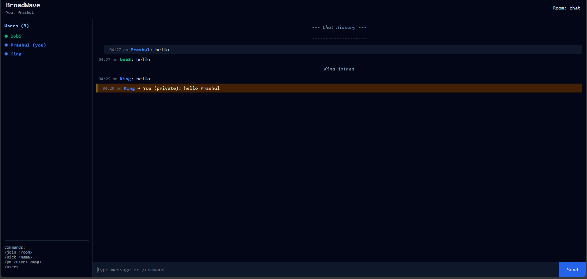

# 🌊 BroadWave

A real-time, multi-room chat application built with WebSockets, Node.js, and MongoDB. Features secure authentication, persistent chat history, and live typing indicators.


##  Features

- 🔐 **Secure Authentication** - Password-protected accounts with SHA-256 hashing
- 🚫 **Unique Usernames** - No duplicate usernames allowed
- 💬 **Real-time Messaging** - Instant message delivery via WebSockets
- 🏠 **Multi-room Support** - Create and join different chat rooms
- 📝 **Persistent History** - MongoDB-backed message storage
- ⌨️ **Typing Indicators** - See when others are typing
- 🔒 **Private Messages** - Send direct messages to specific users
- 🎨 **User Colors** - Each user gets a unique color identifier
- 🔄 **Nickname Changes** - Change your username up to 3 times (persists across sessions)
- 👥 **Live User List** - See who's currently in your room

##  Quick Start

### Prerequisites

- Node.js (v14 or higher)
- MongoDB (v4.4 or higher)
- npm or yarn

### Installation

1. **Clone the repository**
```bash
git clone https://github.com/yourusername/broadwave.git
cd broadwave
```

2. **Install dependencies**
```bash
npm install
```

3. **Set up environment variables**

Create a `.env` file in the root directory:

```env
MONGO_URI=mongodb://localhost:27017/broadwave
PORT=9000
MAX_HISTORY=200
```

4. **Start MongoDB**

Make sure MongoDB is running on your system:

```bash
# macOS (with Homebrew)
brew services start mongodb-community

# Linux
sudo systemctl start mongodb

# Windows
net start MongoDB
```

5. **Start the server**
```bash
node server.js
```

6. **Open the frontend**

Open `frontend/index.html` in your browser or serve it:

```bash
cd frontend
npx serve
```

Then navigate to `http://localhost:3000`
## 📁 Project Structure

```text
BROADWAVE/
├── frontend/
│   ├── index.html        # Main HTML file
│   ├── script.js         # Frontend JavaScript
│   └── style.css         # Styling
├── img/
│   ├── img1.png
│   ├── img2.png
│   └── img3.png
├── node_modules/         # Dependencies
├── .env                  # Environment variables
├── .gitignore            # Git ignore rules
├── client.js             # Terminal client (optional)
├── index.js              # Server entry point
├── package-lock.json     # Dependency lock file
├── package.json          # Project metadata
├── README.md             # This file
├── server.js             # WebSocket server logic
└── show-env.js           # Environment checker
```


## 🎮 Usage

### First Time User

1. Open the application in your browser
2. Click **"Register"** tab
3. Enter a username (3-20 characters) and password (minimum 4 characters)
4. Click **"Register"**
5. You'll automatically join the `lobby` room

### Returning User

1. Click **"Login"** tab
2. Enter your username and password
3. Click **"Login"**
4. Your color and nickname change count are preserved

### Commands

Once logged in, you can use these commands:

| Command | Description | Example |
|---------|-------------|---------|
| `/join <room>` | Switch to a different room | `/join gaming` |
| `/nick <name>` | Change your username (max 3 times) | `/nick cooluser` |
| `/pm <user> <message>` | Send a private message | `/pm alice Hello!` |
| `/users` | List all users in current room | `/users` |

## 🛠️ Technology Stack

### Backend
- **Node.js** - Server runtime
- **ws** - WebSocket library
- **MongoDB** - Database for persistence
- **crypto** - Password hashing

### Frontend
- **Vanilla JavaScript** - No frameworks
- **HTML5** - Structure
- **CSS3** - Styling
- **WebSocket API** - Real-time communication

## 🔒 Security Features

- **Password Hashing** - SHA-256 encryption for all passwords
- **Unique Usernames** - Database-level unique constraint
- **Session Management** - No duplicate logins allowed
- **Input Validation** - Username and password requirements enforced
- **XSS Protection** - HTML escaping for all user content

## 📊 Database Schema

### Users Collection
```javascript
{
  username: String (unique),
  password: String (SHA-256 hash),
  colorIndex: Number (0-9),
  nickChangeCount: Number (0-3),
  createdAt: Number (timestamp)
}
```

### Messages Collection
```javascript
{
  room: String,
  username: String,
  text: String,
  time: Number (timestamp),
  colorIndex: Number
}
```

## 🔧 Configuration

### Environment Variables

| Variable | Default | Description |
|----------|---------|-------------|
| `MONGO_URI` | `mongodb://localhost:27017/broadwave` | MongoDB connection string |
| `PORT` | `9000` | WebSocket server port |
| `MAX_HISTORY` | `200` | Maximum messages to load per room |

### Frontend Configuration

Edit `frontend/script.js` to change the WebSocket URL:

```javascript
const WS_URL = "ws://localhost:9000"; // Change to your server URL
```

For production, use `wss://` (secure WebSocket):

```javascript
const WS_URL = "wss://your-domain.com";
```


### MongoDB Atlas Setup

1. Create a free cluster at [MongoDB Atlas](https://www.mongodb.com/cloud/atlas)
2. Get connection string
3. Update `.env`:

```env
MONGO_URI=mongodb+srv://<username>:<password>@cluster.mongodb.net/broadwave
```


### Login Screen



*Clean authentication interface with Login/Register tabs*

### Chat Interface - Lobby


*Real-time messaging with user list, chat history, and typing indicators*

### Multi-room Support with Private Messages


*Private messaging feature highlighted with users in different rooms*

